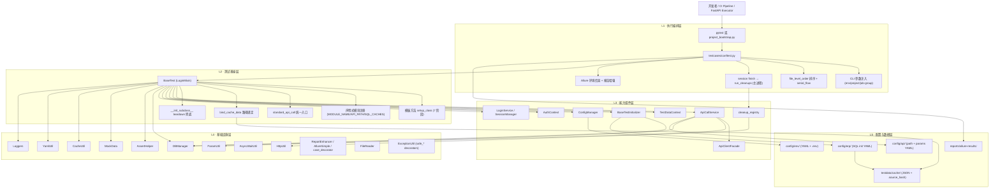
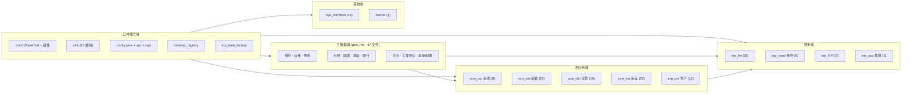
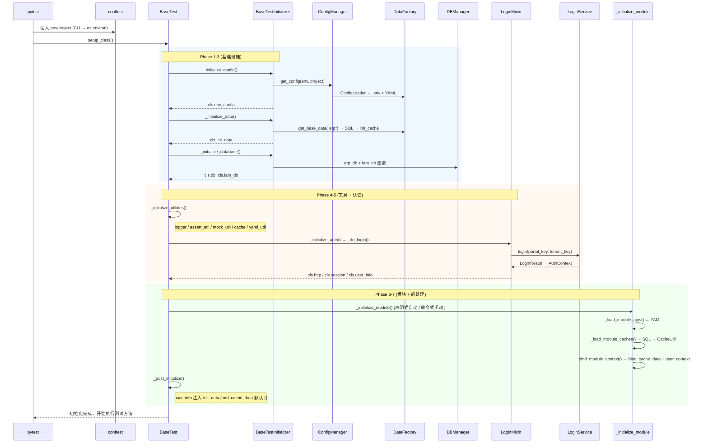
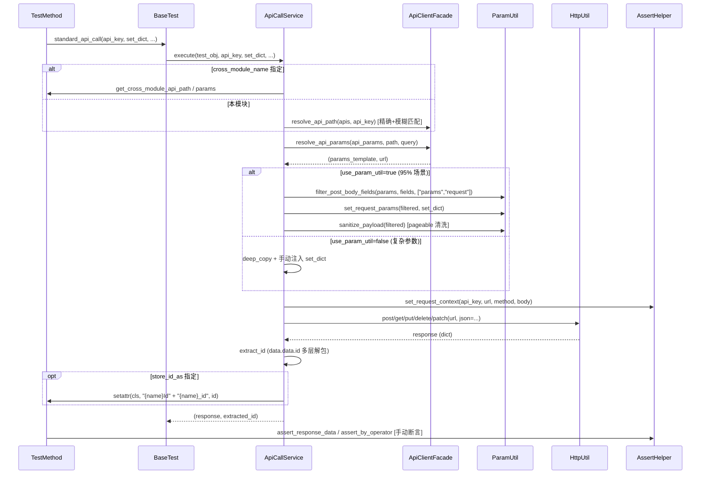
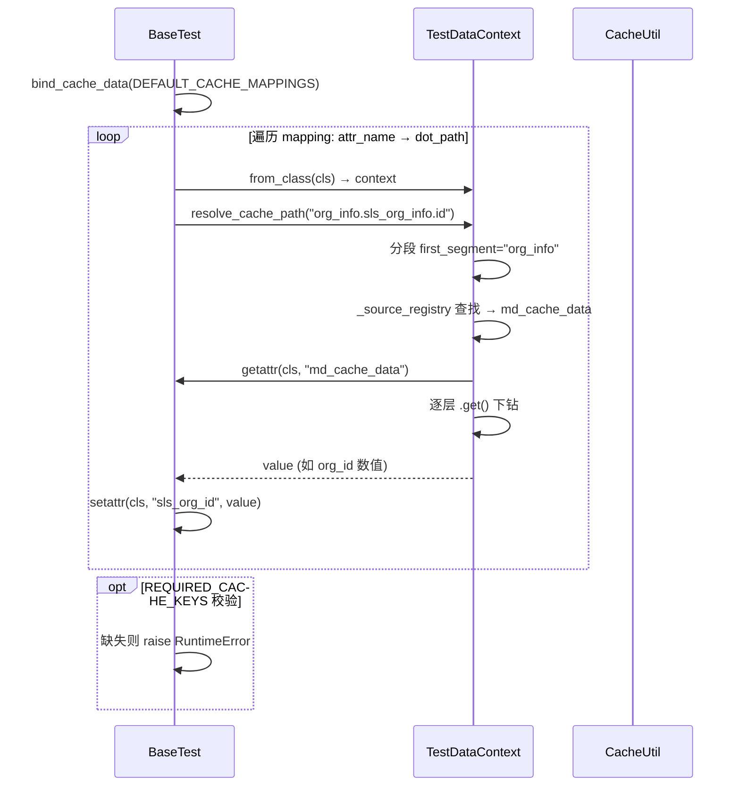
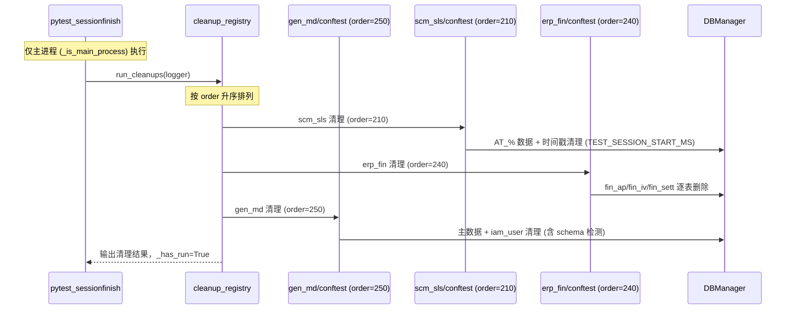
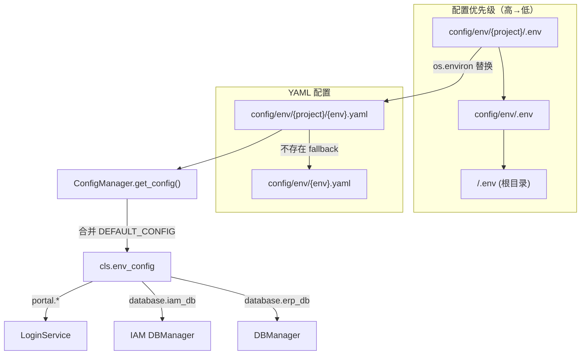

# ERP 自动化测试框架架构设计文档

> **版本**: v2.1 | **最后更新**: 2026-04-02 | **审阅方式**: 全工程代码级 Review

## 1. 文档目标

本文档是 `erp-autotest` 工程的统一架构设计说明，基于对全量源码的逐文件审读，覆盖：

- 技术架构（五层分层、组件职责、继承与协作关系）
- 业务架构（按 ERP 业务域划分的测试能力矩阵）
- 核心时序（初始化、标准调用、数据绑定、清理闭环）
- 数据架构（配置加载、SQL 初始化、缓存模型、路径绑定）
- 关键组件度量（行数、职责、耦合、风险点）
- 非功能性设计（可观测性、稳定性、安全性）
- 风险清单与治理路线

适用于：项目接手、架构评审、实施改造、团队对齐。

---

## 2. 工程概览

### 2.1 当前定位

`erp-autotest` 是基于 Python + pytest 的 ERP API 自动化测试工程，核心目标是：

1. 标准化 API 自动化测试实现（统一入口 `standard_api_call`）；
2. 统一测试数据初始化与依赖绑定（SQL → 缓存 → 类属性）；
3. 提供可观测、可复用、可治理的测试执行体系（Allure + Loguru + 注册式清理）。

### 2.2 工程规模

| 指标 | 数值 |
|------|------|
| 测试模块（业务域） | 13 个（gen_md, scm_pur, scm_sls, scm_del, scm_inv, erp_fin, erp_prd, erp_cond, erp_fi, erp_acc, sys_common, trantor, comm） |
| 测试文件（`test_*.py`） | ~207 个 |
| 测试方法（`def test_`） | ~700+ 个 |
| 工具模块（`utils/`） | 15 个 |
| 核心框架文件（`comm/`） | 10 个 |
| API 配置 YAML | 覆盖 12 个业务域 |
| SQL 初始化 YAML | base / md / fin / pur / del / inv / cond / fi / acc |

### 2.3 核心技术栈

| 类别 | 技术 | 用途 |
|------|------|------|
| 语言 | Python 3.9+ | 主语言 |
| 测试框架 | pytest + allure-pytest | 用例组织与报告 |
| 并行执行 | pytest-xdist (`-n auto --dist loadscope`) | 进程级并行 |
| 失败重试 | pytest-rerunfailures | 网络抖动容错 |
| HTTP 客户端 | requests（经 `HttpUtil` 封装） | API 调用 |
| 数据库 | PyMySQL + DBUtils（经 `DBManager` 封装） | 数据初始化与验证 |
| 配置管理 | YAML + python-dotenv | 多环境多项目支持 |
| Mock 数据 | Faker (zh_CN) 经 `MockData` 封装 | 中文测试数据生成 |
| Web 服务 | FastAPI + uvicorn | 测试执行 API + 报告服务 |
| 流量录制 | mitmproxy | API 录制转用例 |
| 代码质量 | ruff + pre-commit | 格式化 + Lint |
| 日志 | loguru（经 `Loggers` 封装） | 结构化日志 |
| CI/CD | Erda Pipeline → Docker → DiceHub | 自动化部署与执行 |

### 2.4 项目目录结构

```
erp-autotest/
├── config/
│   ├── env/                    # 多环境配置（YAML + .env）
│   │   ├── {project}/          # 项目级配置（如 demo2/）
│   │   └── test.yaml           # 默认环境配置
│   ├── api/{module}/           # API 路径与参数 YAML（per 业务域）
│   └── erp/                    # SQL 初始化配置（base/md/fin/...）
├── testcases/
│   ├── comm/                   # 核心框架层（BaseTest + 组件）
│   ├── gen_md/                 # 主数据域测试（47 文件）
│   ├── scm_sls/                # 销售域（22 文件）
│   ├── scm_pur/                # 采购域（8 文件）
│   ├── scm_del/                # 交货域（10 文件）
│   ├── scm_inv/                # 库存域（22 文件）
│   ├── erp_fin/                # 财务域（38 文件）
│   ├── erp_prd/                # 生产域（11 文件）
│   ├── erp_cond/ erp_fi/ erp_acc/ # 条件/FI/核算域
│   ├── sys_common/             # 系统通用域（28 文件）
│   ├── trantor/                # 平台域
│   └── conftest.py             # 根 pytest 钩子
├── utils/                      # 基础工具层（15 个模块）
├── erp_data_factory/           # 数据工厂产品包（SDK/CLI/FastAPI + compat/legacy）
├── routers/                    # FastAPI 路由（执行器 + 报告）
├── api_record/                 # mitmproxy 录制工具
├── script/                     # 运维脚本（自检/质量守护/Swagger 解析/覆盖率统计）
├── testdata/cache/             # SQL 缓存 JSON（自动生成）
├── reports/                    # Allure 报告输出
├── static/                     # Swagger UI 静态资源
├── main.py                     # FastAPI 入口
├── pytest.ini                  # pytest 配置
├── pyproject.toml              # Ruff 配置
├── requirements.txt            # 依赖清单
├── Dockerfile / dice.yml       # 部署配置
└── pipeline.yml                # Erda CI Pipeline
```

---

## 3. 技术架构设计

### 3.1 五层架构图



### 3.2 继承与协作关系

```
继承链:
  object → LoginMixin → BaseTest → {Module}BaseTest → TestXxxManagement

协作关系 (组合/委托):
  BaseTest ──uses──▶ BaseTestInitializer (构造期)
  BaseTest ──uses──▶ ApiCallService.execute (运行期)
  BaseTest ──uses──▶ TestDataContext (缓存路径解析)
  BaseTest ──uses──▶ ConfigManager (配置加载与校验)
  LoginMixin ──uses──▶ LoginService → SessionManager (登录与会话)
  LoginMixin ──uses──▶ AuthContext.from_login_result (不可变 DTO)
  ApiCallService ──uses──▶ ApiClientFacade → ParamUtil (路径解析 + 参数组装)
  conftest.py ──uses──▶ cleanup_registry.run_cleanups (session 清理)
```

### 3.3 关键组件清单

| 组件 | 文件 | 行数 | 核心职责 | 设计模式 |
|------|------|------|---------|---------|
| `BaseTest` | `comm/base_test.py` | 494 | 框架主编排中心：环境/登录/数据库/缓存绑定/API 入口 | Template Method + 声明式配置 |
| `LoginMixin` | `comm/login_mixin.py` | 154 | 策略化登录（single/admin_with_cust/multi） | Strategy |
| `BaseTestInitializer` | `comm/base_test_initializer.py` | 67 | setup_class 前 3 阶段：配置/基础数据/数据库 | Builder |
| `ConfigManager` | `comm/config_manager.py` | 162 | 环境配置加载/校验/缓存/密码脱敏 | Cache + Validation |
| `LoginService` | `comm/login_service.py` | 327 | IAM HTTP 登录 + Cookie 登录 + 用户信息获取 | Service |
| `SessionManager` | `comm/login_service.py` | (内嵌) | PID 维度的 session 生命周期管理 | Process-keyed Singleton |
| `AuthContext` | `comm/auth_context.py` | 26 | 登录成果不可变 DTO | Immutable Dataclass |
| `ApiCallService` | `comm/api_call_service.py` | 203 | `standard_api_call` 下沉实现：参数组装/HTTP/ID 提取 | Static Service |
| `ApiClientFacade` | `comm/api_client_facade.py` | 63 | API 路径精确+模糊匹配、参数解析 | Facade |
| `TestDataContext` | `comm/test_data_context.py` | 143 | 缓存 dot-path 解析、source 注册路由 | Registry |
| `cleanup_registry` | `comm/cleanup_registry.py` | 44 | 模块级清理函数注册与 session 末统一执行 | Registry + Once |
| `DataFactory` | `erp_data_factory/legacy/base.py` | 575 | 配置加载 + SQL 执行 + 缓存构建 + hash 失效（迁移承接层） | Factory + Cache |

### 3.4 工具层组件清单

| 工具 | 文件 | 行数 | 核心能力 |
|------|------|------|---------|
| `DBManager` | `utils/mysql_util.py` | 359 | MySQL 连接（类级别单例 + 实例池模式）、CRUD、物理删除开关 |
| `HttpUtil` | `utils/request_util.py` | 183 | requests.Session 封装、重试、Decimal 处理、日志 |
| `AssertHelper` | `utils/assert_util.py` | 263 | 响应断言、运算符比较、请求上下文记录 |
| `MockData` | `utils/mock_util.py` | 467 | Faker 中文数据、唯一编码（线程安全计数器）、时间戳 |
| `CacheUtil` | `utils/cache_util.py` | 236 | 文件 JSON 缓存、mtime TTL、refresh callback、purge |
| `ParamUtil` | `utils/param_util.py` | 370 | 嵌套请求体过滤/合并、pageable 清洗、类型转换、ID 提取 |
| `ReportEnhancer` / `case_decorator` | `utils/report_util.py` | 396 | Allure 集成、`file_level_order` 排序、smoke 标记 |
| `Loggers` | `utils/log_util.py` | 225 | loguru 配置（console + 文件轮转）、depth 修正 |
| `YamlUtil` | `utils/yaml_util.py` | 97 | YAML 加载 + 内存缓存（CSafeLoader） |
| `AsyncWaitUtil` | `utils/async_wait_util.py` | 352 | 异步任务轮询等待、状态断言、Allure 记录 |
| `ExceptionUtil` | `utils/exception_util.py` | 465 | 类型化异常体系、safe_* 装饰器工厂 |
| `ResponseUtil` | `utils/response_util.py` | 83 | DecimalEncoder、响应数据解包 |
| `FileReader` | `utils/file_util.py` | 326 | Excel/CSV 读取（pandas）、校验 |
| `DingTalk` | `utils/dingtalk_util.py` | 16 | Webhook 通知 |

---

## 4. 业务架构设计

### 4.1 业务测试域图



### 4.2 业务测试能力分层

| 层级 | 能力 | 覆盖范围 |
|------|------|---------|
| L1 主数据能力 | 组织、伙伴、物料、币种等基础依赖 | 所有业务域的前置数据 |
| L2 单据能力 | CRUD + 导入导出链路 | 创建→查询→更新→导出→删除 |
| L3 流程能力 | 跨模块状态流转与上下游依赖 | 采购→交货→财务、销售→交货→结算 |
| L4 权限能力 | 多门户（admin/cust）数据可见性 | sys_common LOGIN_STRATEGY=multi |

### 4.3 模块初始化模式对比

框架支持两种子类使用方式：

**声明式（推荐）** — 设置类变量，无需覆盖 `setup_class`：

```python
class ScmDelBaseTest(BaseTest):
    MODULE_NAME = "SCM_DEL"
    LOGIN_STRATEGY = "admin_with_cust"
    API_PATH_FILE = "config/api/scm_del/del_api_path.yaml"
    API_PARAMS_FILE = "config/api/scm_del/del_api_params.yaml"
    SQL_CACHES = [
        {"path": "config/erp/del_init_sql.yaml", "key": "del_init_cache", "attr": "del_cache_data"},
    ]
```

**命令式（复杂场景）** — 手动编排初始化逻辑：

```python
class FinBaseTest(BaseTest):
    LOGIN_STRATEGY = "single"

    @classmethod
    def setup_class(cls):
        super().setup_class()
        cls.load_api_configs()      # 手动加载（可合并多文件）
        cls.load_cache_data()       # 手动缓存
        cls.bind_context()          # 手动绑定
```

| 模块 | 模式 | 基类 | 文件数 | 特殊能力 |
|------|------|------|--------|---------|
| gen_md | 声明式 | GenMdBaseTest | 47 | MD + FIN 缓存、`_bind_module_context` 扩展 |
| scm_pur | 声明式 | ScmPurBaseTest | 8 | pur 缓存 + 清理注册 |
| scm_sls | 命令式 | SlsBase | 22 | 多 YAML 合并、domain helper（create_sales_order 等） |
| scm_del | 声明式 | ScmDelBaseTest | 10 | del 缓存 |
| scm_inv | 声明式 | ScmInvBaseTest | 22 | inv 缓存（复用 md_init_sql） |
| erp_fin | 命令式 | FinBaseTest | 38 | context_builder、重量级 domain helper |
| sys_common | 声明式 | SysCommonBaseTest | 28 | multi-portal 登录 |
| erp_prd | 命令式 | PrdBaseTest | 11 | 从 erp_prd.order 重导出 |

---

## 5. 核心时序设计

### 5.1 BaseTest.setup_class 七阶段模板



### 5.2 standard_api_call 调用时序



### 5.3 缓存绑定时序



### 5.4 Session 清理时序



---

## 6. 数据架构设计

### 6.1 配置加载模型



**约束**：
- URL 必须包含协议（`http://` / `https://`）
- DB 端口必须可转整型
- 禁止 `${VAR}` 原样进入运行时（`ConfigLoader._replace_env_vars` 递归替换）
- SQL 支持 `${VAR:-default}` 语法（`SQLExecutor._render_sql`）

### 6.2 SQL → 缓存 → 绑定 数据流

```mermaid
flowchart LR
    SQL["config/erp/*_init_sql.yaml"]
    -->|YamlUtil.read_yaml| CFG["sql_config dict"]
    -->|SQLExecutor.execute_sql_config| DB[(MySQL)]
    -->|递归执行 + Decimal→float| DATA["result dict"]
    -->|CacheUtil.set| JSON["testdata/cache/{key}.json"]
    -->|SHA-256 sidecar| HASH[".{key}.source_hash"]

    JSON -->|CacheUtil.get (TTL 校验)| CACHE["内存 cache_data"]
    CACHE -->|TestDataContext.resolve_cache_path| BIND["cls.sls_org_id = value"]
```

**缓存失效策略**：
1. **TTL 失效**：测试环境 5 分钟、生产 1440 分钟（`SQLInitializer._get_default_expire_minutes`）
2. **SQL YAML 变更失效**：SHA-256 比对源文件（`_invalidate_json_cache_if_sql_yaml_changed`）
3. **项目切换失效**：`TEST_PROJECT` 变化时清除缓存（`_clear_cache_if_project_changed`）
4. **手动清除**：`pytest --fresh-cache` 调用 `CacheUtil.purge_disk_cache_files`

### 6.3 缓存键值清单

| 缓存 Key | SQL YAML 来源 | 数据内容 | 消费者 |
|----------|--------------|---------|--------|
| `init_cache` | `base_init_sql.yaml` | 币种/国家/地址/银行/工作中心/日历 | 所有模块（`init_data`） |
| `md_init_cache` | `md_init_sql.yaml` | 组织/伙伴/物料/配送中心/仓库 | gen_md / scm_* / erp_fin（`md_cache_data`） |
| `fin_init_cache` | `fin_init_sql.yaml` | 财务组织/科目/期间 | erp_fin / gen_md（`fin_cache_data`） |
| `pur_init_cache` | `pur_init_sql.yaml` | 采购组织/供应商 | scm_pur（`pur_cache_data`） |
| `del_init_cache` | `del_init_sql.yaml` | 交货类型/路线 | scm_del（`del_cache_data`） |
| `inv_init_cache` | `md_init_sql.yaml` | 复用 MD 数据 | scm_inv（`inv_cache_data`） |

### 6.4 TestDataContext 路由注册

`TestDataContext` 通过 `_source_registry` 将 dot-path 的第一段映射到类属性：

```python
# 默认注册（BaseTest）
"currency_info"  → init_data
"country_info"   → init_data
"partner_info"   → md_cache_data
"org_info"       → md_cache_data
"mat_info"       → md_cache_data

# 模块扩展（子类 register_source）
"pur_config"     → pur_cache_data
"fin_org_info"   → fin_cache_data
```

---

## 7. 支撑系统设计

### 7.1 FastAPI 执行服务

| 路由 | 方法 | 功能 |
|------|------|------|
| `/executor/run` | POST | 异步启动 pytest，返回 task_id |
| `/executor/status/{task_id}` | GET | 查询执行状态，完成时发送 DingTalk |
| `/data-factory/get_base_data` | GET | 触发 SQL 初始化，返回 base_data |
| `/reports/allure` | GET | 重定向到 Allure HTML 报告 |
| `/docs` | GET | 自定义 Swagger UI |

**CI 集成**：`pipeline.yml` 的 `api-test` 阶段 POST `/executor/run` 触发全量执行。

### 7.2 运维脚本

| 脚本 | 用途 |
|------|------|
| `script/project_bootstrap.py` | 全量自检：Python 版本、包依赖、目录骨架、.env 配置、DB 连通、登录、SQL YAML、API YAML |
| `script/quality_guard.py` | P1 治理：secret 扫描、teardown 调用 super 检查（AST）、禁止 test 互调 |
| `script/swagger_parser.py` | OpenAPI → `config/api/` YAML 自动生成 |
| `script/case_coverage_stat.py` | 用例覆盖率统计：API path 调用覆盖 vs YAML 定义 |

### 7.3 API 录制工具


特性：请求序号排序、host/path 过滤、cookie/auth 脱敏、文件分片轮转、去重。

---

## 8. 非功能性设计

### 8.1 可维护性

| 机制 | 说明 |
|------|------|
| 组件化拆分 | BaseTest 从 ~1000 行收敛至 494 行，拆出 8 个独立组件 |
| 声明式配置 | 新模块仅需设置类变量，无需覆盖 `setup_class` |
| `__init_subclass__` 兜底 | 子类遗漏 `super().teardown_class()` 仍可执行基类清理 |
| pre-commit + quality_guard | ruff 格式化 + 骨架检查 + secret 扫描 + teardown 合规 |
| case_decorator | 统一 Allure 元数据 + `file_level_order` 排序 |

### 8.2 可观测性

| 层级 | 工具 | 覆盖 |
|------|------|------|
| 测试报告 | Allure（step/attachment/environment） | 请求响应、失败原因、异步等待过程 |
| 结构化日志 | Loggers（loguru + depth） | 所有组件统一日志格式 |
| 环境诊断 | project_bootstrap.py | 启动前可执行自检 + 输出明确诊断 |
| 执行监控 | FastAPI `/executor/status` + DingTalk | CI 执行进度通知 |

### 8.3 稳定性

| 机制 | 说明 |
|------|------|
| 进程级并行 | xdist `-n auto`，每个 worker 独立进程，无共享内存 |
| 串行分组 | `--job-group=serial` + `serial_flow` marker |
| 失败重试 | pytest-rerunfailures 处理网络抖动 |
| 缓存失效 | TTL + SQL hash + 项目切换检测 |
| 集中清理 | cleanup_registry 仅主进程执行，避免 worker 间冲突 |

### 8.4 安全性

| 机制 | 说明 |
|------|------|
| 凭据管理 | `.env` 注入，不进仓库；`ConfigManager.get_safe_config` 密码脱敏 |
| SQL 安全 | DBManager 强制参数化查询；`DB_DELETE_SAFETY_CHECK` WHERE 检测 |
| 物理删除开关 | `ENABLE_PHYSICAL_DELETE=false` 时 delete 被拦截 |
| secret 扫描 | `quality_guard.py` pre-commit 阶段检测 |
| 数据隔离 | 测试数据统一 `AT_` 前缀 |

---

## 9. 架构风险与治理

### 9.1 已识别风险

| # | 风险 | 影响 | 严重度 |
|---|------|------|--------|
| R1 | `BaseTest` 仍是高耦合集中点（494 行，13+ 直接依赖） | 改动回归半径大 | 中 |
| R2 | 声明式 vs 命令式双轨并存 | 新人认知负担，维护成本翻倍 | 中 |
| R3 | `ApiCallService.execute` 硬编码日志 "状态码: 200" | 非 200 场景日志误导 | 低 |
| R4 | `store_id_as` 直接 `setattr(cls, ...)` 共享类状态 | 测试间状态泄漏（同类内串行时安全） | 低 |
| R5 | 部分业务工厂直接 HTTP 调用（`pur_po_factory` 等） | 与 `standard_api_call` 标准不统一 | 中 |
| R6 | `CacheUtil` 无文件锁 | xdist 多 worker 冷启动并发写同一 JSON 可能损坏 | 中 |
| R7 | 子模块 conftest 重复 `_get_erp_db_config()` 模式 | 代码漂移、维护分散 | 低 |
| R8 | `AssertHelper` 类级别 `_last_request_context` | 进程内非线程安全（当前 xdist 进程级，实际安全） | 低 |
| R9 | `DecimalEncoder` 在 `mysql_util` 和 `response_util` 中重复定义 | 漂移风险 | 低 |
| R10 | `gen_md/conftest.py` 清理逻辑过重（235 行、schema 检测） | 高复杂度、维护成本 | 低 |
| R11 | `assert_response_time` ms 分支双重缩放 `max_time` | 默认 1000 变 1000000ms，断言名存实亡 | 低 |
| R12 | `main.py` 的 `sys.path` 指向 `parent.parent`（可能越过项目根） | 非标部署路径下 import 异常 | 低 |

### 9.2 治理路线

#### 已完成（截至 2026-04-02）

- [x] 数据工厂主路径统一为 `erp_data_factory`（SDK/CLI/FastAPI）
- [x] M1 达成：Org/Material/Partner 三场景三端可用（统一返回结构）
- [x] M2 达成：代码调用路径迁移到 `erp_data_factory`（`compat` 兼容层承接）
- [x] 旧 `data_factory/` 目录下线，历史实现并入 `erp_data_factory/legacy`
- [x] M3 部分达成：能力清单、统一错误码、执行审计上下文、可选异步任务（进程内）

#### 进行中（短中期）

- [ ] 将 `erp_data_factory/legacy` 中能力逐步迁入 `application/domain`，减少历史耦合
- [ ] 推进命令式模块向声明式迁移（R2），目标：`scm_sls`、`erp_fin`、`erp_prd`
- [ ] 收敛 `BaseTest` 依赖（R1）：将 `safe_api_call`、`AsyncWaitUtil` 等按需 mixin 化
- [ ] 建立关键链路回归集（多门户 + 缓存 + 清理 + 跨模块流程）
- [ ] 统一新增代码必须走 `standard_api_call`，冻结新增“直连 HTTP 工厂”模式

#### 长期

- [ ] 建立失败知识沉淀与回归防回滚机制（failure-knowledge-flywheel）
- [ ] 形成架构守护规则（自动扫描违规调用模式，扩展 quality_guard）
- [ ] 探索 contract-test 层级（API schema 变更感知）
- [ ] 统一 naming convention：`AssertHelper` → `AssertUtil`、`MockData` → `MockUtil`（文档与代码对齐）

---

## 10. 实施与评审清单

### 新增用例评审

- [ ] 是否使用 `standard_api_call`（禁止直接 `http.post`）
- [ ] 是否使用 `case_decorator` + `file_level_order`（禁止 `@pytest.mark.run`）
- [ ] 是否通过 `bind_cache_data` / `init_data` / `md_cache_data` 获取依赖（禁止硬编码 ID）
- [ ] 是否具备三层断言（响应成功 → 字段正确 → 业务结果），必要时 DB 校验
- [ ] 是否使用 `self.mock_util` 生成测试数据（禁止硬编码、禁止 `MockData()` 直接实例化）
- [ ] 测试数据是否使用 `AT_` 前缀

### 架构合规评审

- [ ] 新模块是否优先使用声明式基类模式
- [ ] 清理是否注册到 `cleanup_registry`，顺序是否符合依赖关系（子表先删）
- [ ] 配置是否全部通过 `.env` + YAML 注入，无敏感信息硬编码
- [ ] teardown_class 是否保证 `super().teardown_class()` 被调用
- [ ] 幂等策略：创建/关联接口是否处理"已存在"错误码

### 文档同步评审

- [ ] 新增模块是否更新本文档的模块清单
- [ ] API YAML 是否通过 `swagger_parser.py` 生成或手动维护
- [ ] 缓存键值是否记录在 6.3 节缓存键值清单中

---

## 11. 附录

### 11.1 关键路径索引

| 类别 | 文件路径 |
|------|---------|
| 执行钩子 | `testcases/conftest.py` |
| 核心基类 | `testcases/comm/base_test.py` |
| 登录策略 | `testcases/comm/login_mixin.py` |
| 登录服务 | `testcases/comm/login_service.py` |
| 配置管理 | `testcases/comm/config_manager.py` |
| 初始化器 | `testcases/comm/base_test_initializer.py` |
| API 调用 | `testcases/comm/api_call_service.py` |
| API 解析 | `testcases/comm/api_client_facade.py` |
| 数据上下文 | `testcases/comm/test_data_context.py` |
| 认证 DTO | `testcases/comm/auth_context.py` |
| 清理注册 | `testcases/comm/cleanup_registry.py` |
| 数据工厂 | `erp_data_factory/client.py`、`erp_data_factory/legacy/base.py` |
| FastAPI 入口 | `main.py` |
| 执行路由 | `routers/api_manage.py` |
| 自检脚本 | `script/project_bootstrap.py` |
| 质量守护 | `script/quality_guard.py` |
| Swagger 解析 | `script/swagger_parser.py` |
| API 录制 | `api_record/recorder.py` |
| 规则文档 | `AGENTS.md`、`.cursor/rules/*.mdc` |

### 11.2 utils 依赖拓扑

```
log_util          ← (被大多数模块依赖，fan-in 最高)
exception_util    ← mock_util, file_util
response_util     ← assert_util, cache_util, request_util (依赖 log_util)
param_util        (零内部依赖)
yaml_util         (零内部依赖)
report_util       (零内部依赖, 被 async_wait_util 依赖)
dingtalk_util     (零内部依赖)
```

### 11.3 清理 order 登记

| Module conftest | order | 清理范围 |
|-----------------|-------|---------|
| scm_sls | 210 | 时间戳 + AT_% 数据 |
| scm_del | 220 | DN/SO 备注和类型编码 |
| scm_inv | 220 | 库存配置/移库单据 |
| erp_fin | 240 | fin_ap/fin_iv/fin_sett |
| gen_md | 250 | 主数据 + iam_user（含 schema 检测） |
| sys_common | 210 | 组织/打印/异步/API/GEI |
